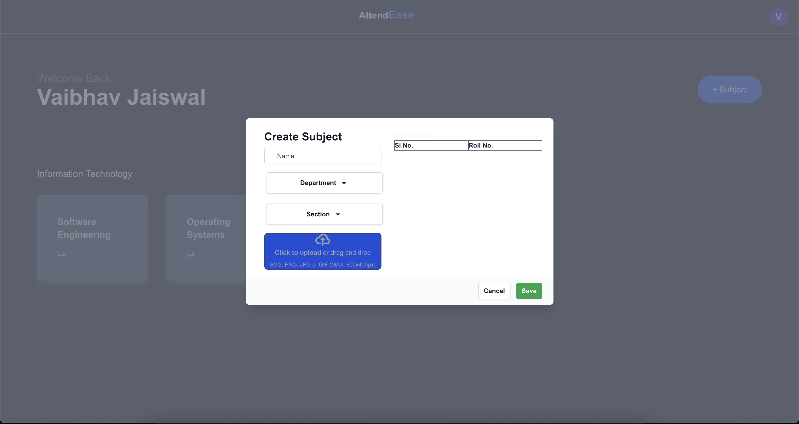
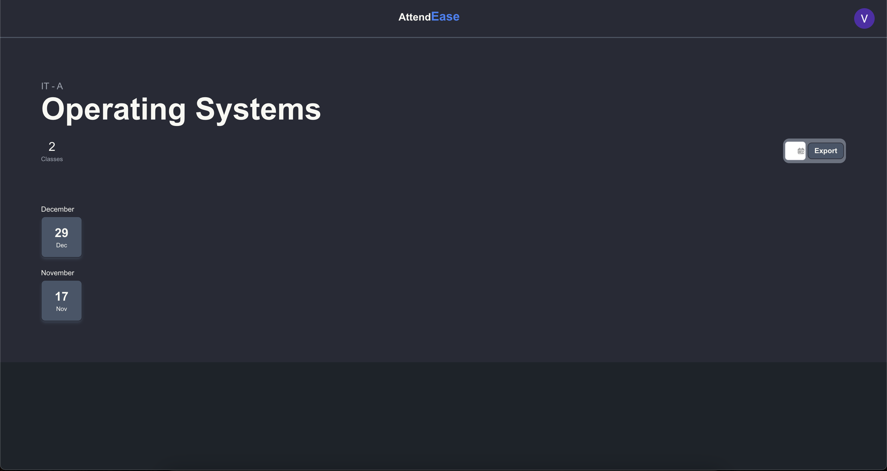
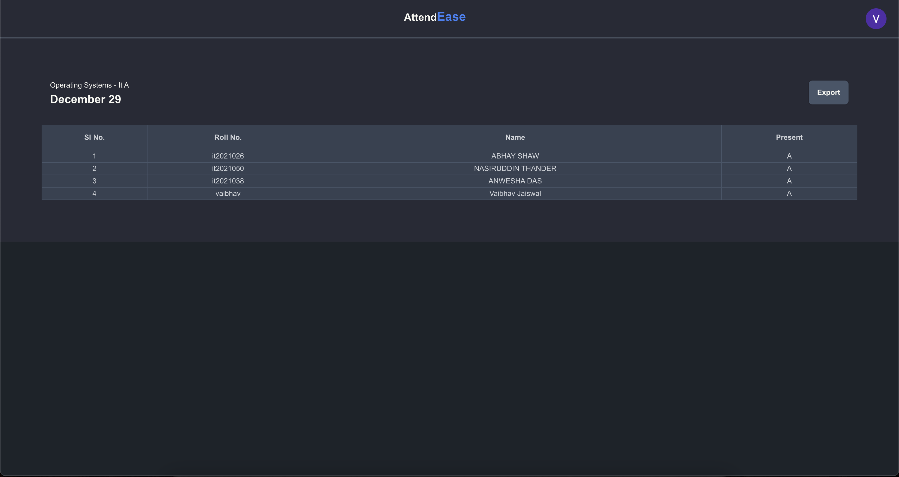

# AttendEase - Manage your attendance with ease

## About

AttendEase is a Attendance Recording and Tracking app built for the HOD of IT Department Dr.Hironmoy Roy for the IT
Department of RCCIIT.  

#### AttendEase consists of -

- Web Panel for Teachers
- [Android App for Teachers](https://github.com/Vaibhav2002/AttendEase)
- [Android App for Students](https://github.com/Vaibhav2002/AttendEase)

## AttendEase Web Panel

AttendEase Web Panel is built for Teachers to easily view and analyze the attendance of thier subjects and classes.
Teachers can easily view the attandance %age, attendees/absentees of their classes.
On top of all this Teachers can also export the Attendance of a class or all classes in a date range in an Excel Sheet
for easy integration in College's official Attendance.

### Features

- Attendance Tracking and Analysis
- CSV Import of students enrolled in a subject, to avoid any unknown students
- Exporting Attendance of a class or a range of classes
- Managing subjects and classes with their attendance

### Screenshots

|                            |                                  |
|----------------------------|----------------------------------|
|     |  |
|  |          | |

